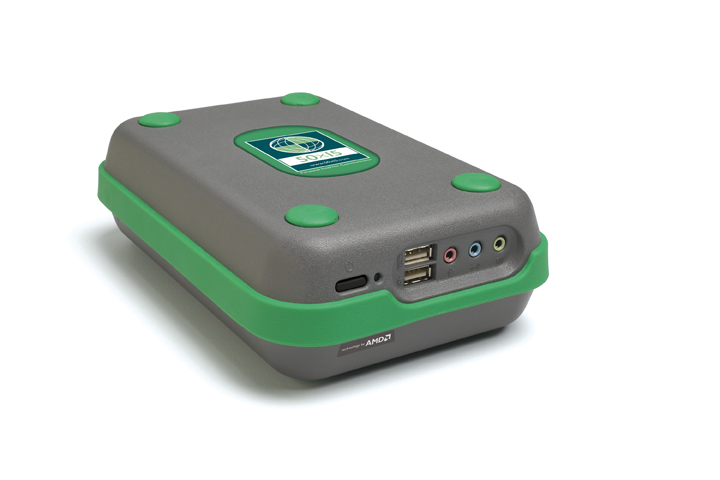

# Installing Linux on the AMD Personal Internet Communicator (PIC)

Notes on install Linux on the AMD [Personal Internet Communicator](https://en.wikipedia.org/wiki/Personal_Internet_Communicator) (PIC).

The PIC was shipped with a locked-down BIOS which prevented the installation of any other operating system.  Fortunately, someone created a hacked BIOS which circumvents this: [PICMOD.ROM](PICMOD.ROM).

## Credits

- [Photo](https://commons.wikimedia.org/wiki/File:50x15_Personal_Internet_Communicator_(PIC).jpg)
